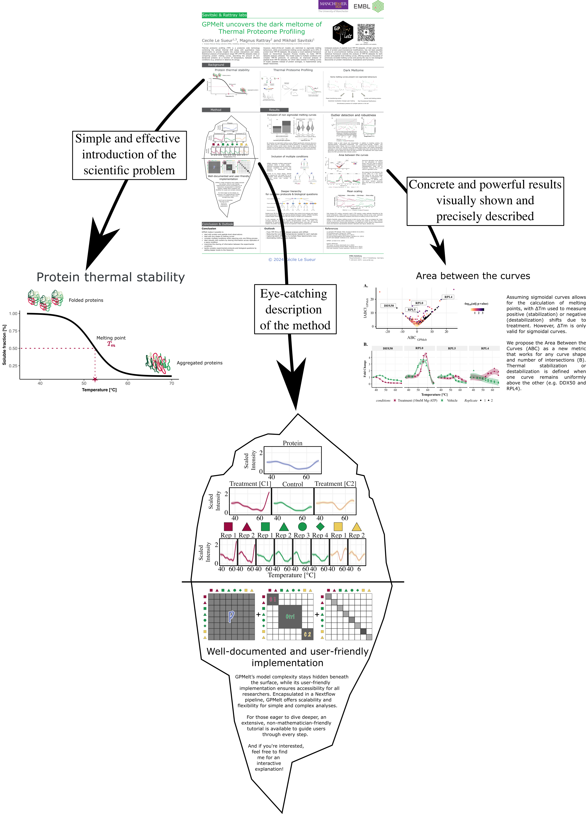

  

  Challenges
  

  At international conferences, posters session are **usually short** (2h), and the **competition is intense**, with a huge number of presented posters (typically over hundreds). The real challenge is to **stand out from the crowd to attract the audiance** and pitch the project in a short time before they move to another poster.  
  It's a real **marketing exercise**: in only few minutes of attention from the audiance, I need to introduce the limitation of previously developed statistical framework, highlight the consequences of these limitations and present our **innovative solution** to the problem. The description of the methodology should remain conceptual, but clear enough to support the presented results. As presenter, it's fundamental to **spark interest and enthusiasm** among listeners, to create a lasting impression that will predominate over all other posters seen that day, thus maximising the chance that the audiance will remember the project to look at it in more detail later on. Poster sessions are really about **advertising the project** to convince futur users. **Effort on the branding** (e.g. software name and logo, simplicity of the ressources' accessibility via QR code) are essential.  
  Similarly, **visual appeals** are crucial to **pique scientists' curiosity** while they do a first tour of posters to select which ones to investigate during the poster session. Additionally, the poster should have an **appropriate informational depth**, to stand alone without explanation for audiance that would go through it outside of the poster session.

<!--
  - Capture attention in a high-density, time-constrained environment (poster session)
  - Communicate a complex methodological framework clearly and quickly to an audiance with diverse background
  - Balance:
    - visual appeal (to attract viewers)
    - informational depth (to stand alone without explanation)-->

  
  

  

  Approach
  

  I designed the poster as a **self-contained narrative**, combining **visual impact with layered information**.
     
  Key elements:

  - a **clear visual entry point** to introduce the problem and context;
  - use of a **central visual metaphor (iceberg)** to:
    - reassure applied users;
    - de-emphasize intimidating theoretical depth;
  - **structured layout** highlighting:
    - key features of the tool;
    - practical value and use cases;
  - emphasis on readability and visual hierarchy for **quick scanning**.
  
  This conference poster is designed for both:

  - **quick engagement** during sessions
  - **independent reading** outside presentation time
  

  

  

  Strengths
  

  - Ability to distill complex scientific work into a **clear, engaging narrative**;
  - **visual storytelling** for persuasion and user engagement;
  - designing content for **constrained attention environments**;
  - balancing **clarity, completeness, and attractiveness**.
  

  

  Impact
  

  The poster session at HUPO 2024 has been **particularly effective**, managing to attract and **gather a large crowd** for the whole duration of the session. Numerous scientists with little mathematical background **emphasized my capacity to make complex mathematical concepts sound simple and straightforward**, and thank me for the exciting introduction to my project. Lots of them got really interested and stayed by my poster for a long time, **asking numerous questions**, highlighting their strong interest and curiosity, along with their trusts in me to be able to explain them to the level they needed. Thanks to this poster session, the name of **GPMelt got in the head of numerous experimentalists** working on TPP data, who **recontacted me after** the conference.

::::: {style="margin-top: 2rem; border: 1px solid rgba(0,0,0,0.2); box-shadow: 0 6px 14px rgba(0,0,0,0.12); border-radius: 8px; padding: 1em;" id="ex-Poster"}

<!--

  Results

 -->

  Poster

  Designed to communicate both the intuition and practical value of the method within a few minutes of attention.
   

{.lightbox width=100%}

:::::