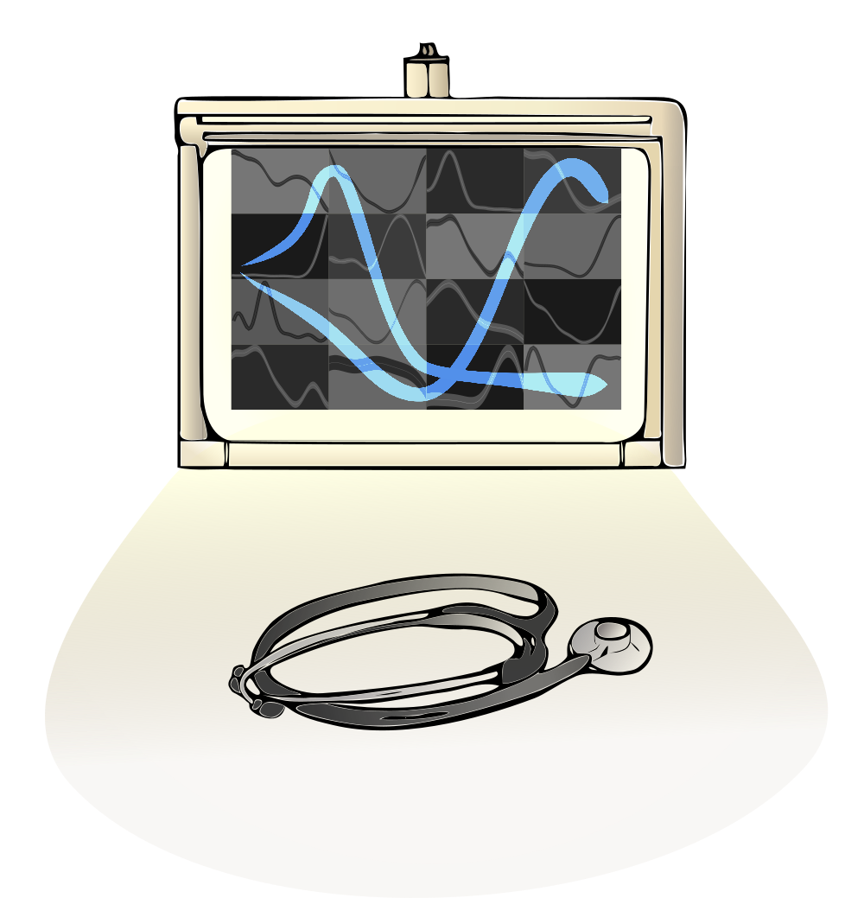

:::: {.grid style="margin-top: 2rem; margin: auto; max-width: 90%;"}

::: {.g-col-4}
{.lightbox width=100%}
:::

::: {.g-col-8 style="text-align: justify;"}
This image captures the **transformative power** of GPMelt to fully explore the complexity of melting curve behavior. 

The **mosaic of non-sigmoidal curves** in the background symbolizes the diverse range of melting profiles that GPMelt can integrate. Unlike state-of-the-art methods, GPMelt is agnostic to curve shape, breaking free from the constraints of sigmoidal melting behavior. Every curve — no matter how irregular — finds a place in the analysis, allowing for a more **inclusive understanding of the thermal proteome**.

**Illuminated by the X-ray viewer**, two non-sigmoidal curves emerge from the shadows. No longer obscured or discarded, they become fully accessible and visible, ready for interpretation. **GPMelt brings these previously overlooked curves into the spotlight, making them a valuable part of the TPP-TR dataset**. This comprehensive vision transforms our capacity to analyze protein thermal stability, opening up new possibilities for discovery.

**The stethoscope**, lit by the X-ray viewer’s glow, serves as a **metaphor for GPMelt’s diagnostic power**. It symbolizes the newfound ability of users to uncover and diagnose these unconventional curves. GPMelt doesn't just detect atypical melting behaviors; it empowers users to explore the underlying biology, leading them toward novel discoveries. By fitting all curve types, including the most complex, GPMelt opens the door to advanced analyses like clustering, which could inspire hypotheses about the origins of non-sigmoidality and reveal deeper biological insights.

In essence, GPMelt is not just a tool; **it’s a breakthrough that exposes previously hidden part of the meltome**, pushing the boundaries of thermal proteome profiling and **giving access to biological phenomena that were previously out of reach**.
:::

::::