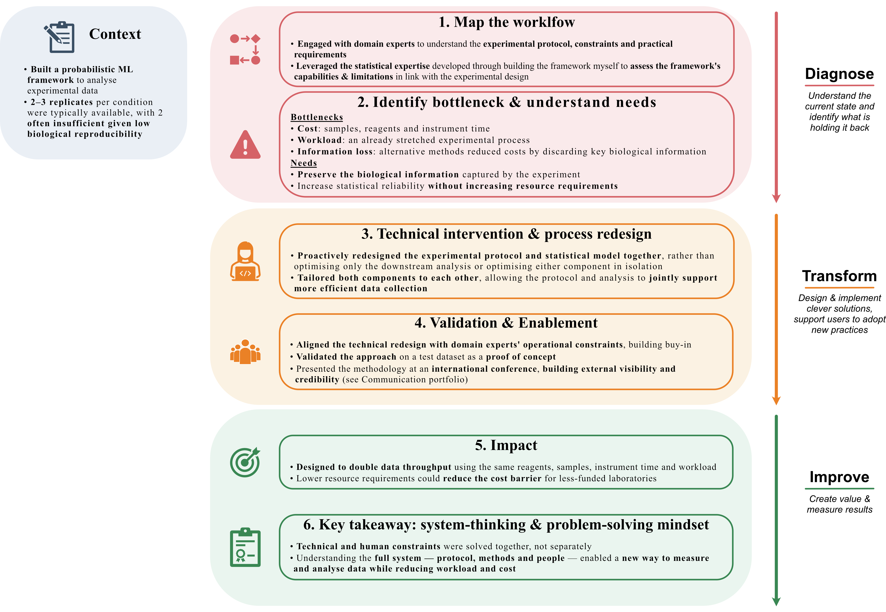

{.lightbox width=70%}

# From problem to impact {#sec-text}

## The problem
Two constraints dominated the workflow: the cost of reagents and samples, and the workload of running and measuring them via mass spectrometry. Existing methods in the field (@gaetani2019proteome, @zijlmans2023stpp) addressed this by cutting sample count and measurement time — but only by discarding the shape of the melting curve, data that recent research suggests carries real biological signal. **The field's standard fix for the cost problem was quietly trading away information that mattered.**

## Workflow diagnosis
Discussions with the experimental team surfaced the real bottleneck: existing approaches optimised the analysis method while treating the experimental protocol as fixed. **Nobody had questioned whether the protocol itself needed to stay fixed while only the analysis flexed**. Reframing the protocol as adjustable — not just the analysis — was the key step toward a viable solution.

## Options considered
- *Do nothing:* keep the existing protocol; accept the cost/workload ceiling.
- *Adopt an existing fast method* (@gaetani2019proteome, @zijlmans2023stpp): cuts cost and time, but sacrifices melting-curve shape data.
- *Redesign protocol and statistical model together:* the option pursued — changing how data is collected and how it's processed, so less raw data still yields statistically valid, shape-preserving results.

## Intervention
**Proposed and prototyped an adapted version of the existing protocol (TPP-TR), designed to halve reagent, sample, and instrument-time consumption while preserving full melting-curve shape measurement** — something existing fast methods couldn't do. This required redesigning both ends: how the experiment was run, and how the existing ML framework processed the resulting, structurally different data, including new preprocessing and adjustments to the underlying statistical model to preserve replicate-level rigor. We refer to chapter 7 of @LeSueurThesis for technical details.

## Validation & enablement
Validated the approach on a test dataset as proof of concept. Presented the work at an international conference to build visibility and external credibility (see the dedicated page on the [Communication portfolio](../../CommunicationWorkflow/ScienceComm/Talk/index.qmd)), and worked directly with lab colleagues to walk through the trade-offs and build buy-in for the change. **The project reached proof-of-concept stage rather than full lab rollout, due to time constraints within the PhD — but the statistical validation and conference reception indicate it's ready for a lab to take further**.

## Impact
**For the same reagents, samples, and instrument time, the redesigned protocol was projected to double data throughput without reducing the replicate count needed for statistical confidence.** 

Beyond the immediate efficiency gain, this would reduce workload on already-stretched experimental teams and **lower the cost barrier for labs to use the method** at all — widening access to a technique otherwise limited to well-funded groups.

## What I learned
The instinct to reach for "more data" is often the wrong lever. **The gain came from questioning an assumption everyone treated as fixed, and from understanding the constraints of the people doing the experimental work, not just the statistical ones.**

Technology adoption isn't only about better answers to the scientific question — it's about redesigning the process around the people who have to live with it.