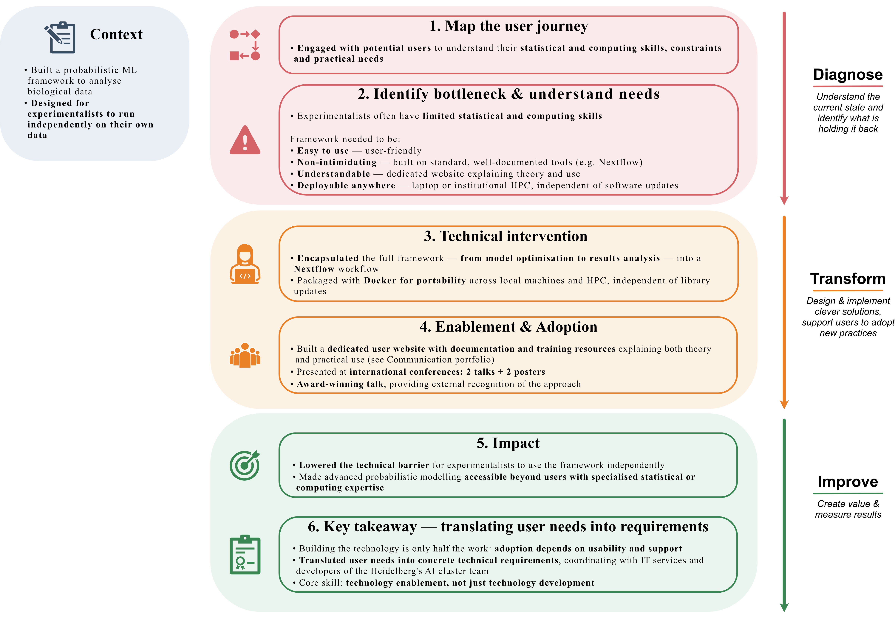

{.lightbox width=70%}

# From problem to impact {#sec-text}

## The problem
Biologists running these experiments typically have limited statistical training and limited computing experience. **A framework that worked for developers and data analysts wasn't automatically usable by a broader audience encompassing the biologists themselves.**

## Workflow diagnosis
The framework itself wasn't the barrier — access to it was. Through conversations with potential users, I identified four concrete requirements a usable version would need to meet:

* it had to be easy to use, 
* non-intimidating (built on tools users already trusted), 
* genuinely understandable (not just runnable), 
* and deployable in whatever environment the user actually had — a personal laptop or an institutional HPC cluster — without ongoing dependency maintenance. 

**This reframed the task from "package a new probabilistic ML framework" to "redesign how the model reaches its users."**

## Options considered
- *Distribute as a script or notebook:* fastest to release, but assumes a statistical and coding fluency most biologists don't have.
- *Package as a standard Python library (pip-installable):* lower barrier than raw code, but still requires environment setup and command-line comfort most users lacked.
- *Containerize with Docker only:* portable and dependency-free, but without workflow orchestration, still exposes users to technical setup.
- *Nextflow + Docker + dedicated documentation website:* **the option pursued — pipeline orchestration, containerized portability, and a plain-language explanation layer combined, minimizing the technical background required to use the tool.**

## Intervention
Encapsulated the full framework — from model optimisation through results analysis — into an **open-source Nextflow workflow, packaged with Docker** so it runs identically on a personal laptop or an institutional HPC cluster, independent of underlying library updates ([GitLab repository](https://git.embl.de/grp-savitski/gpmelt)). 

Built a dedicated website ([GPMelt website](https://gpmelt-website-grp-savitski-be284daa99aadeca97f8e634d7838ce7b92.embl-community.io/contents/home.html), see also the dedicated page on the [Communication portfolio](../../CommunicationWorkflow/Teaching/Tutorials/index.qmd)) explaining both the statistical theory behind the model and the practical steps to run it, so **users could understand *what* the tool is doing, not just execute it as a black box.**

## Enablement/adoption
Maintained the **user website as the primary point of entry for new users**. Presented the tool at **international conferences — two talks and two posters** (see also the dedicated page for one poster on the [Communication portfolio](../../CommunicationWorkflow/ScienceComm/Poster/index.qmd)), with **one talk receiving an award** — to build visibility and credibility with the target scientific community.

## Impact
The redesigned **framework became usable by a broad user base**: any experimentalist, not just those with a statistics, computer science or ML background. It runs consistently across computing environments (laptop to HPC) without user-side maintenance, and the award-winning conference reception independently validated the approach beyond my own assessment.

## What I learned
Building advanced technology to solve a complex problem is only half the work. **People won't use a method they don't understand or can't install and run in practice — user training, documentation, and support are a core part of a technology developer's job, not an afterthought.** 

This meant **translating user needs into concrete technical requirements and coordinating delivery with technical teams** to complete my own expertise — in this case, institutional IT services and developers from the AI Health Innovation Cluster team at Heidelberg.