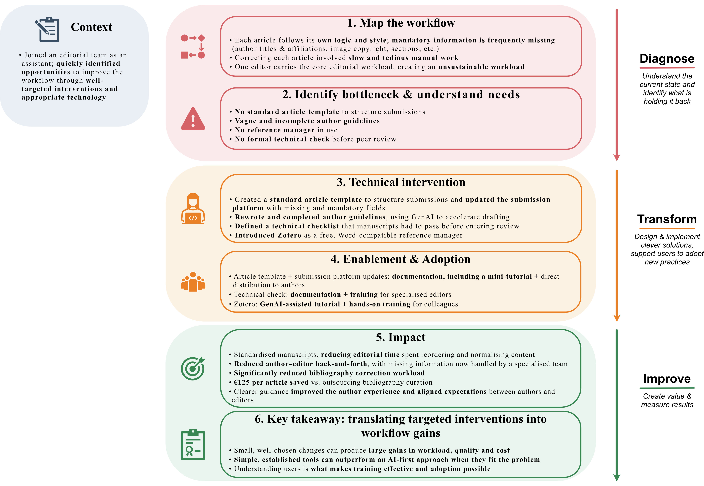

{.lightbox width=70%}

# From problem to impact {#sec-text}

## The problem
Every article followed its own internal logic and style, with mandatory information frequently missing (author titles & affiliations, image copyright, sections, etc.). Correcting each article involved **slow and tedious manual work**. With only one editor on the team, the **workload was becoming unsustainable**.

## Workflow diagnosis
The root causes were structural, not individual effort: no article template existed, author guidelines were vague and incomplete, no reference manager was in use, and there was no formal technical check before a manuscript entered review. **None of these gaps required advanced technology to fix — they required someone to notice they were gaps at all.**

## Options considered
- *Reference management:* a paid tool (EndNote, Mendeley) vs. Zotero — free, Word-compatible, no budget approval needed, and low enough friction that non-technical authors could adopt it directly.
- *Author guidelines:* rewrite manually from scratch vs. use Gen AI to accelerate drafting a complete, clear version — chosen to move faster without compromising on the clarity the team needed.
- *Technical check:* ad hoc, editor-by-editor judgment vs. a defined, explicit rule set every manuscript must pass before review — chosen for consistency and to make the check trainable and delegable, not dependent on a single editor's memory.

## Intervention
* Created a standard article template. 
* Rewrote and completed the author guidelines with Gen AI assistance. 
* Defined an explicit technical checklist manuscripts had to satisfy before entering the review stage. 
* Introduced Zotero as the team's reference manager, building a complete tutorial (Gen AI-assisted) and training colleagues directly, changing the workflow so bibliographies were handled correctly at the source rather than corrected after the fact.

## Enablement/adoption
**Each intervention paired a tool with matching documentation and training**: the template went out to authors directly with clear instructions; the technical check was documented and taught to the specialised editors responsible for applying it; Zotero adoption was driven by a tutorial plus hands-on training for colleagues.

## Impact
* **Manuscript quality improved** — fewer missing mandatory sections, cleaner bibliographies. 
* Standardisation **cut the editorial time spent** reordering and normalising articles. 
* **Author-facing back-and-forth over missing information dropped**, now handled by a specialised team rather than the core editor. 
* **Bibliography-related workload fell** sharply, and the reference-manager switch **avoided roughly €125 per article** in costs previously paid to an external team. 
* Authors reported a clearer process (via the template) and better-aligned expectations with editors (via the guidelines).

## What I learned
**Small changes can produce outsized effects on workload, quality, and cost.**

**Before reaching for AI, it's worth checking whether a simpler, well-established tool or concept — like a template — already solves the problem; these are often faster to implement and just as effective.**

Knowing your users well enough to **pitch training at the right level** is what actually determines whether a tool gets adopted or ignored.
