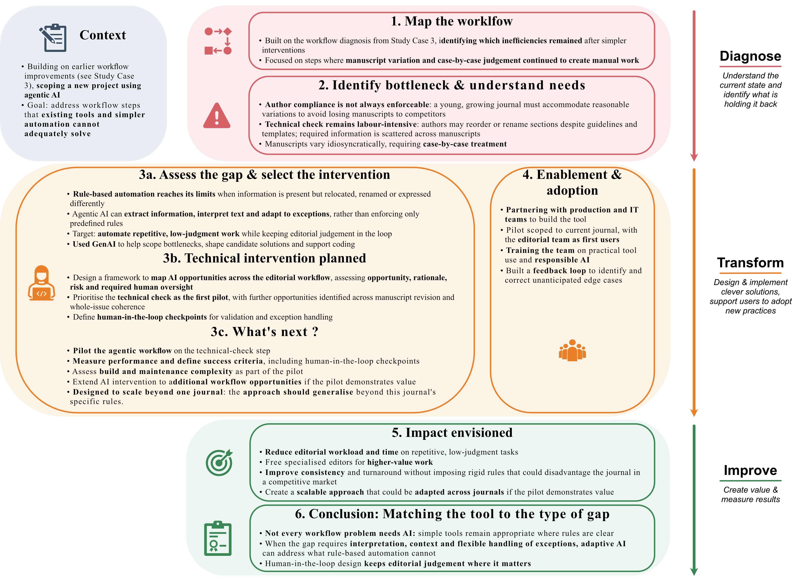

{.lightbox width=70%}

# From problem to impact {#sec-text}

## The problem
Three factors compound the remaining inefficiencies.
`
*  First, the journal's market position: unlike an established scientific journal, authors here aren't always willing to comply with editorial requests, and the editorial team has to accommodate them to avoid losing manuscripts to competitors, since the journal is still establishing itself. 
* Second, the technical check remains manually intensive — authors reorder or rename sections despite the template and guidelines, and required information isn't always in a consistent location, forcing manual copy-paste work. 
* Third, manuscripts vary in idiosyncratic ways that resist rule-based handling and often require case-by-case judgment.

## Workflow diagnosis 
The earlier interventions (template, guidelines, technical checklist) solved the *structural* gaps in the workflow, but exposed a **different kind of bottleneck: judgment calls that don't reduce to a fixed rule set**. A standard automation script can enforce "section X must exist" — it can't decide what to do when an author reorders sections in a plausible but non-standard way, rename it or when a genuine exception should be accommodated to avoid losing a manuscript. **That gap — needing reasoning and flexibility rather than rule enforcement — is what pointed toward agentic AI rather than further rule-based automation.**

## Options considered

- *Extend the rule-based technical check further:* add more explicit rules for known variations. Rejected: manuscript variation is too open-ended; rules would multiply indefinitely without covering genuine edge cases.
- *Manual case-by-case handling by editors (status quo):* works, but doesn't scale as the journal grows and consumes senior editorial time on low-judgment tasks.
- *Agentic AI workflow:* **an LLM-based system capable of information extraction, section reordering, and adaptive reasoning across manuscript variation** — the option pursued, because it can flexibly reason through exceptions rather than requiring every exception to be pre-specified.

## Intervention (proposed)

Designed a framework mapping candidate AI interventions across the workflow, using GenAI itself to help identify bottlenecks and shape solution options — evaluating each step by AI opportunity, rationale, risk, and where human oversight remains necessary:

| Workflow step | AI opportunity | Why AI | Risk | Human role |
|---|---|---|---|---|
| Technical check | Extract required info regardless of manuscript structure; reorder/rename sections to match template | Needs text understanding and flexible reasoning across varied structures — a rules engine can't anticipate every exception | May misinterpret ambiguous content; risk of false negatives on real errors | Editor reviews flagged discrepancies before the manuscript proceeds |
| Manuscript correction | Spelling, grammar, and typographic conventions (e.g. non-breaking spaces before French punctuation) | Combines deterministic rules (typography) with contextual language understanding (grammar, style) faster than manual proofreading | Over-correction risk — altering author voice or flagging valid domain-specific terms as errors | Editor validates suggested corrections, especially domain terminology |
| Bibliography consistency check | Flag citations missing a reference entry (or vice versa); catch non-Zotero submissions with formatting drift | Requires matching content across two parts of a document and recognising equivalent citations in varied formats — beyond what the reference manager alone enforces | May mismatch similar-but-different entries; misses edge cases in unusual citation styles | Editor reviews flagged mismatches before publication |
| Whole-issue coherence check | Flag inconsistent notation/terminology across all articles in an issue; catch mistakes remaining after per-article correction | Requires holding and comparing content across multiple full-length documents at once — impractical to track manually with full recall | Risk of false positives on legitimate topic-driven variation; too many minor flags could overwhelm editors | Editor decides which flagged inconsistencies warrant issue-wide standardisation |

## Enablement & adoption
The rollout is planned **in partnership with the production and IT teams**, with the **longer-term ambition of extending the approach beyond this journal to others across the company**. The initial scope is deliberately narrow: a pilot on the current journal, with my own editorial team as first users. Training will cover practical use of the tool, but also serves a second purpose — **building shared understanding of responsible AI use within the team**. A **feedback loop with the team** is built into the design from the start, since the agentic workflow is expected to need correction as it encounters edge cases not yet anticipated.

## Impact (envisioned)
**Reducing editorial time spent on repetitive, low-judgment tasks, freeing specialised editors' time for higher-value work, and improving manuscript-handling consistency** and turnaround — without imposing rigidity that risks losing manuscripts to competitor journals in a market where authors have alternatives.

## What I learned so far
Not every workflow bottleneck needs the same fix. [Study Case 3](StudyCase3.qmd) shows that templates and checklists solve structural gaps, where the requirement is clear and just needs enforcing. 

This case is different: the gap isn't a missing rule but a missing **capacity to interpret meaning across variation — recognising that information is present but relocated, or that a section is mislabeled rather than absent.** 

Matching an interpretation-heavy problem to a tool built for interpretation, rather than defaulting to more rules or defaulting to AI everywhere, is the judgment this case actually demonstrates.